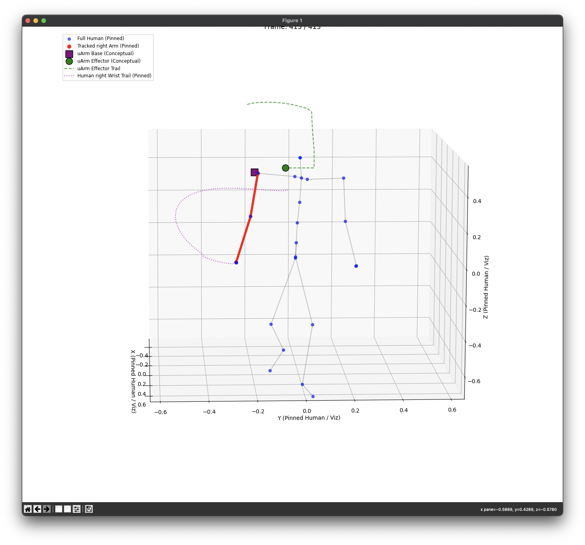

# Real-time Human Arm Motion to uArm Swift Pro Mimicry

## 🌟 Project Overview

This project, developed as part of ESE650, translates 3D human arm motion data into real-time control commands for a uArm Swift Pro robotic arm. The system processes sequences of 3D human joint positions, focusing on the dominant arm's shoulder-elbow-wrist kinematics. It then maps these movements to the uArm's coordinate space and operational range, driving the uArm to mimic the observed human arm motions. A live 3D visualization aids in monitoring and debugging by displaying both the human pose and the uArm's conceptual target simultaneously.

**This repository specifically implements the physical robot arm (uArm Swift Pro) control and pose-mapping portion of the larger "Genuine-ESFP" project, which can be found at [https://github.com/Qifei-C/Genuine-ESFP](https://github.com/Qifei-C/Genuine-ESFP).**

---
<p align="center">
  
</p>
---

## ✨ Features

* **Human Pose Input**: Reads 3D human joint data from `.npz` files (e.g., AMASS-derived or custom formats).
* **Arm Tracking**: Isolates and tracks the shoulder, elbow, and wrist joints of a user-specified arm (right or left).
* **Kinematic Mapping**:
    * Calculates the relative vector from the human's shoulder to their wrist.
    * Employs dynamic scaling to adapt human arm proportions to the uArm's operational workspace.
    * Manages complex coordinate system transformations between the human pose data (often left-handed, Z-up) and the uArm's native SDK coordinate system (right-handed, with user-defined physical placement).
* **uArm Swift Pro Control**:
    * Establishes and maintains a stable connection with the uArm Swift Pro using the official Python SDK.
    * Sends real-time `set_position` (XYZ coordinates) and `set_wrist` (angle) commands.
    * Utilizes a separate thread for uArm control to ensure non-blocking operation of the main application and visualization.
* **Live 3D Visualization**:
    * Renders the full human skeleton using Matplotlib, with the pose pinned at the root joint for a stable viewing perspective.
    * Clearly highlights the tracked human arm (shoulder, elbow, wrist).
    * Displays a conceptual representation of the uArm's base and its target effector position within the same 3D environment, scaled appropriately.
    * Includes motion trails for both the human wrist and the uArm effector to visualize trajectories.
* **Configurable Placement Modes**: Supports different physical orientations of the uArm (e.g., standard upright, side-mounted) with corresponding adjustments in the coordinate mapping logic.
* **Modular Codebase**: Recently refactored into distinct Python modules for configuration, utility functions, uArm control logic, visualization components, and the main application script, enhancing code clarity, testability, and maintainability.

## 🛠️ System Architecture (Post-Refactoring)

The project's codebase is organized into the following Python modules:

* `main_mapper.py`: The main entry point of the application. It initializes and coordinates all other modules, handles the overall program flow, and starts the animation loop.
* `config_arm_mapper.py`: A centralized configuration file storing all constants, calibration values, file paths, uArm settings (serial port, speeds), mapping parameters (scales, offsets), and skeleton definitions.
* `uarm_mimic_controller.py`: Contains the `UArmMimicController` class. This core class is responsible for:
    * Loading and pre-processing the human 3D pose sequences.
    * Establishing and managing the connection with the uArm Swift Pro.
    * Implementing the primary kinematic mapping algorithm (`calculate_uarm_target_for_frame`) which translates human arm movements to uArm target coordinates.
    * Managing the threaded control loop that sends continuous commands to the uArm.
* `arm_mapping_utils.py`: A collection of helper functions, including:
    * Loading pose data from `.npz` files.
    * Retrieving arm-specific joint indices from skeleton definitions.
    * Functions for coordinate system transformations (e.g., calculating rotation matrices for different uArm placements relative to the visualization space).
    * Management of Python's `sys.path` for local module and uArm SDK accessibility.
* `arm_visualization.py`: Dedicated to all 3D visualization tasks using Matplotlib. It includes:
    * Initialization of the 3D plot and all its artists (scatter plots for joints, lines for bones and motion trails).
    * The animation update function (`update_animation_frame`) which is called repeatedly by `FuncAnimation` to refresh the display based on the latest data from the `UArmMimicController`.

### Directory Structure Preview:

```text
ESE650prj_videoToArm/
├── main_mapper.py
├── config_arm_mapper.py
├── uarm_mimic_controller.py
├── arm_mapping_utils.py
├── arm_visualization.py
├── data/
│   └── 00/
│       └── joints_drc_smooth.npz  # Example input data
├── uarm-python-sdk/                # uArm Python SDK v2.0
│   └── uArm-Python-SDK-2.0/
│       └── uarm/
├── src/                              # Source for kinematic utilities
│   └── kinematics/
│       ├── skeleton_utils.py
│       └── ... (other kinematics files if any)
├── docs/                             # (Recommended for images)
│   └── images/
│       └── demo_animation.gif        # (Example GIF)
└── README.md
```

## ⚙️ Setup and Installation

### Prerequisites

* Python 3.7+
* uArm Swift Pro (with appropriate firmware, e.g., v3.2.0 as tested)
* Required Python packages:
    * `numpy`
    * `matplotlib`
    * `pyserial` (usually a dependency of the uArm SDK)

### Installation Steps

1.  **Clone the Repository**:
    ```bash
    git clone <https://github.com/Yuang-Zhou/skeleton-to-uarm>
    cd ESE650prj_videoToArm
    ```

2.  **Set up Python Environment**:
    It's recommended to use a virtual environment:
    ```bash
    python -m venv venv_arm
    source venv_arm/bin/activate  # On Windows: venv_arm\Scripts\activate
    ```

3.  **Install Dependencies**:
    A `requirements.txt` file would be beneficial here. If you have one:
    ```bash
    pip install -r requirements.txt
    ```
    Otherwise, install packages manually:
    ```bash
    pip install numpy matplotlib pyserial
    ```
    *Note: The provided `uarm-python-sdk` is included locally and its path is managed by `arm_mapping_utils.py` or `main_mapper.py`.*

4.  **uArm Setup**:
    * Connect the uArm Swift Pro to your computer via USB.
    * Power on the uArm.
    * Ensure no other software (like uArm Studio) is actively connected to the uArm, as the serial port can typically only be used by one application at a time.

5.  **Configure the Project**:
    Open `config_arm_mapper.py` and verify/update the following critical settings:
    * `UARM_SERIAL_PORT`: Set this to the correct serial port for your uArm (e.g., `/dev/cu.usbmodemXXXXX` on macOS, `COMX` on Windows). Set to `None` for auto-detection if unsure, but specifying is more reliable.
    * `NPZ_FILE_RELATIVE_PATH`: Ensure this points to your input `.npz` motion data file.
    * `UARM_PLACEMENT_MODE`: Set to `'upright'` or `'side_mounted_native_x_cw90'` based on your physical uArm setup.
    * `UARM_SHOULDER_ORIGIN_OFFSET`: Calibrate this offset if needed. It defines the conceptual human shoulder's position in the uArm's native coordinate system (in mm).
    * Other mapping parameters like `UARM_TARGET_MAPPED_ARM_LENGTH_MM` and scaling factors might need tuning for optimal performance.

## 🚀 How to Run

1.  Ensure all setup steps are completed and the uArm is connected and powered on.
2.  Navigate to the project's root directory (where `main_mapper.py` is located).
3.  Activate your Python virtual environment (if used).
4.  Run the main script:
    ```bash
    python main_mapper.py
    ```

A Matplotlib window should appear showing the 3D visualization, and if the uArm is correctly connected and configured, it should start mimicking the arm movements from the input data file.

---
<p align="center">
  <p align="center">
  
</p>

---

## 💡 Kinematic Mapping and Coordinate Systems

### Human Pose Data
* Input 3D joint positions are typically in a left-handed coordinate system:
    * **+X**: Forward (from human's perspective)
    * **+Y**: Leftward
    * **+Z**: Upward
* Joint coordinates are processed relative to the human's root joint (pelvis) for movement calculations.

### uArm Swift Pro SDK
* The uArm SDK uses a right-handed coordinate system native to the arm's base:
    * **SDK_X**: Forward (along the arm's reach direction in its standard upright pose)
    * **SDK_Y**: Upward (perpendicular to the base, in its standard upright pose)
    * **SDK_Z**: Rightward
* All commands sent to `swift.set_position(x, y, z, ...)` must be in this native SDK coordinate system.

### Coordinate Transformation
The `calculate_uarm_target_for_frame` method in `uarm_mimic_controller.py` is responsible for:
1.  Extracting the shoulder-to-wrist vector from the human pose data.
2.  Scaling this vector based on `UARM_TARGET_MAPPED_ARM_LENGTH_MM` and the detected human arm length.
3.  Transforming the scaled human vector into the uArm's native SDK coordinate system. This transformation depends critically on the `UARM_PLACEMENT_MODE` setting in `config_arm_mapper.py`, which dictates how human axes (Forward, Left, Up) are mapped to the uArm's SDK axes (SDK_X, SDK_Y, SDK_Z) considering its physical orientation.
4.  Adding the `UARM_SHOULDER_ORIGIN_OFFSET` (which is defined in uArm SDK coordinates) to the transformed relative vector to get the absolute target XYZ for the uArm effector.
5.  Clipping the final target coordinates to ensure they are within the uArm's safe operational workspace.

## 🔧 Current Status & Potential Improvements

* **Current**: The system can load human motion, connect to the uArm, and attempt to map motion with live visualization. Core refactoring into modules is complete.
* **Debugging Focus**: Current debugging is centered on ensuring the uArm accurately reaches calculated single-frame targets and that the control loop for continuous motion operates smoothly.
* **Future Work**:
    * **Refined Coordinate Mapping**: Further fine-tuning of the coordinate transformation logic for different `UARM_PLACEMENT_MODE`s and precise calibration of `UARM_SHOULDER_ORIGIN_OFFSET`.
    * **Workspace Error Handling**: More sophisticated handling if target coordinates consistently fall outside the uArm's workspace (e.g., scaling down motion dynamically).
    * **Orientation Mimicry**: Currently, only the XYZ position of the wrist is mimicked. Extending this to also mimic wrist orientation would be a significant enhancement. This would involve calculating human wrist orientation and mapping it to uArm's `set_wrist` or potentially more complex inverse kinematics if full end-effector orientation is needed.
    * **Smoother Motion**: Implementing interpolation or filtering on the target uArm commands to achieve smoother physical movements.
    * **User Interface**: A simple GUI for selecting input files, configuring parameters, and starting/stopping the mimicry.
    * **Support for Different Skeletons**: Abstracting skeleton definitions further to easily support other formats beyond SMPL24.

## 🤝 Contributing

Contributions, bug reports, and suggestions are welcome! Please feel free to open an issue or submit a pull request.

## 📄 License

This project is open-source. Please refer to the LICENSE file if one is included, or assume a standard permissive license like MIT if not specified. The uArm Python SDK has its own licensing terms.